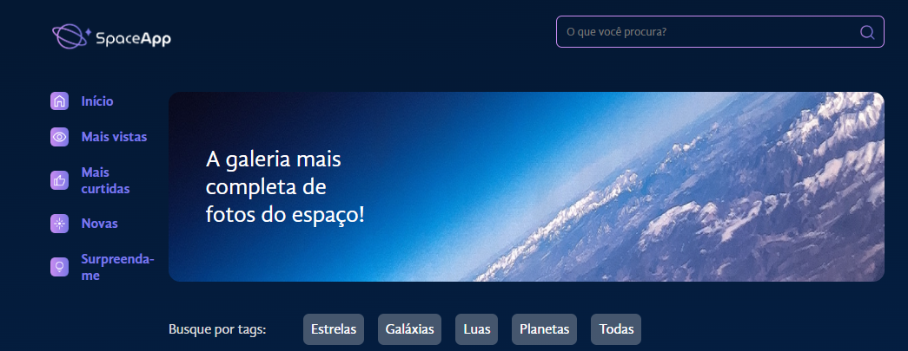
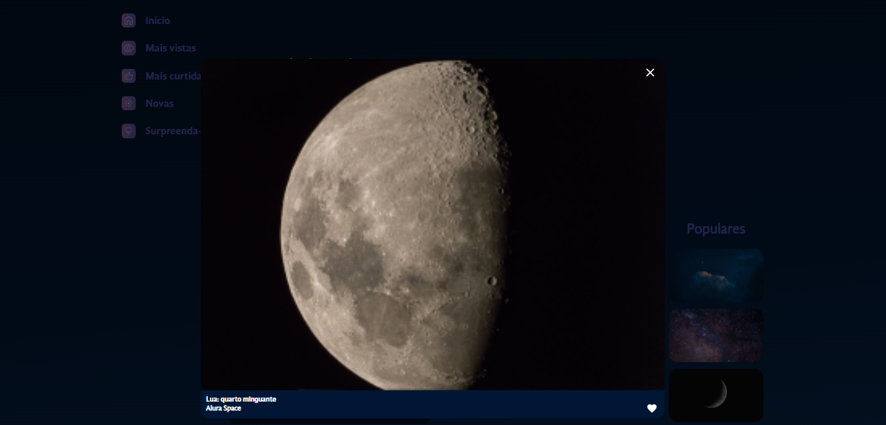
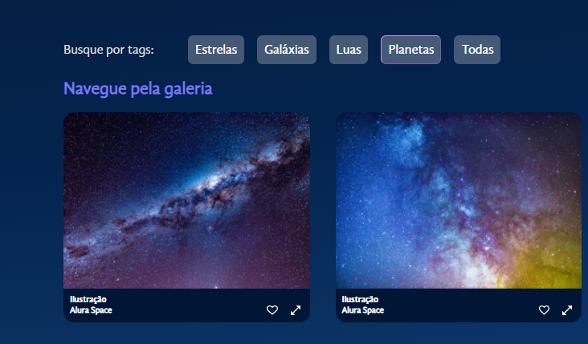

## Welcome! 👋

# Space App Bailo

This is my #3nd REACT project!

### Screen Shots
- Main screenshot



- Image Zoom and Like



- Filter image by type




## Some code that I'm proud of
```js
const ModalZoom = ({ foto, aoFechar, aoAlternarFavorito }) => {
    return (
        <>
            {foto && <>
                <Overlay />
                <DialogEstilizado open={!!foto} onClose={aoFechar}>
                    <Imagem foto={foto} expandida={true} aoAlternarFavorito={aoAlternarFavorito}/>
                    <form method="dialog">
                        <BotaoIcone formMethod="dialog">
                            
                        </BotaoIcone>
                    </form>
                </DialogEstilizado>
            </>}
        </>
    )
}
```

## Built with

- REACT;
- CSS custom properties;
- Styled Components;
- JavaScript.

## Test the project yourself: [Teste the project here!!!](https://space-app-bailo.vercel.app/)

### You can:

- Fiter images by type;
- Zoom an image;
- Like an image.

## Author

- Website - [My GitHub](https://github.com/lucasbailo)
- Frontend Mentor - [@lucasbailo](https://www.frontendmentor.io/profile/lucasbailo)
- Instagram - [@lucassbailo](https://www.instagram.com/lucassbailo/)
- LinkedIn - [Lucas Bailo](https://www.linkedin.com/in/lcsbailo)